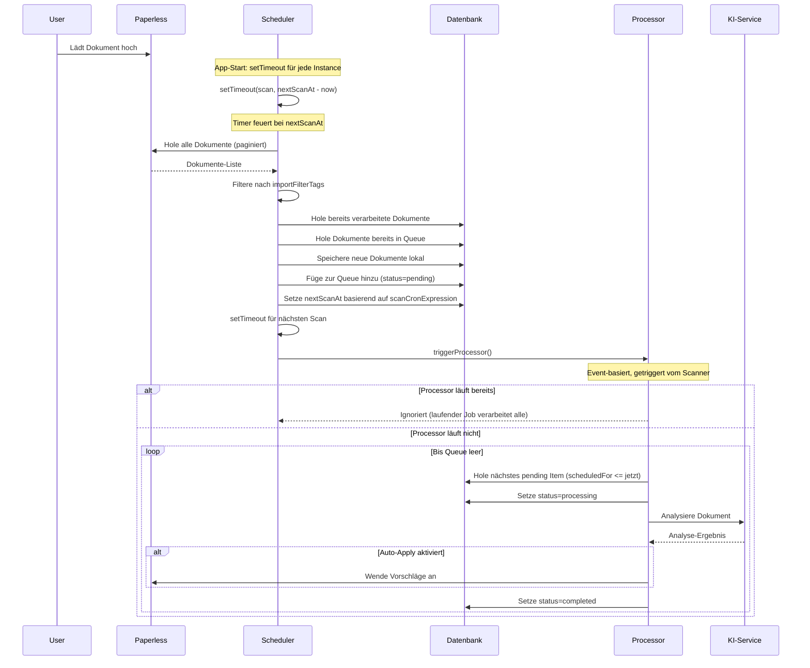

# Scheduled Processing - Automatische Dokumentenverarbeitung

Diese Dokumentation beschreibt den automatisierten Ablauf der Dokumentenverarbeitung.

## Übersicht

Das System besteht aus zwei Komponenten:

| Komponente | Typ                | Aufgabe                                                    |
| ---------- | ------------------ | ---------------------------------------------------------- |
| Scanner    | Timer (setTimeout) | Scannt Instances nach Cron-Expression, plant nächsten Scan |
| Processor  | Event-basiert      | Wird vom Scanner getriggert, verarbeitet Queue bis leer    |

## Ablauf: Neues Dokument in Paperless

## Wartezeit-Berechnung

Die Wartezeit bis ein neues Dokument verarbeitet wird hängt vom konfigurierten `scanCronExpression` ab:

| Phase           | Dauer              | Beschreibung                                      |
| --------------- | ------------------ | ------------------------------------------------- |
| Scan-Intervall  | **Konfigurierbar** | Definiert durch `scanCronExpression` pro Instance |
| Processor-Start | Sofort             | Processor wird direkt nach Scan getriggert        |
| KI-Analyse      | Variabel           | Abhängig vom Dokument und KI-Service              |

### Beispielrechnung

**Konfiguration:** `scanCronExpression = "*/30 * * * *"` (alle 30 Minuten)

| Szenario     | Wartezeit                                              |
| ------------ | ------------------------------------------------------ |
| Best Case    | Sofort (Dokument wird kurz vor Scan hochgeladen)       |
| Worst Case   | ~30 Minuten (Dokument wird kurz nach Scan hochgeladen) |
| Durchschnitt | ~15 Minuten                                            |

## Konfigurationsoptionen pro Instance

| Feld                 | Typ      | Beschreibung                                    |
| -------------------- | -------- | ----------------------------------------------- |
| `autoProcessEnabled` | Boolean  | Aktiviert/deaktiviert automatische Verarbeitung |
| `scanCronExpression` | String   | Cron-Ausdruck für Scan-Intervall                |
| `defaultAiBotId`     | String   | KI-Bot für automatische Analyse                 |
| `importFilterTags`   | Number[] | Nur Dokumente mit diesen Tags verarbeiten       |

### Auto-Apply Optionen

| Feld                     | Beschreibung                               |
| ------------------------ | ------------------------------------------ |
| `autoApplyTitle`         | Vorgeschlagenen Titel automatisch anwenden |
| `autoApplyCorrespondent` | Korrespondent automatisch setzen           |
| `autoApplyDocumentType`  | Dokumenttyp automatisch setzen             |
| `autoApplyTags`          | Tags automatisch zuweisen                  |
| `autoApplyDate`          | Dokumentdatum automatisch setzen           |

## Queue-Status

| Status       | Bedeutung                          |
| ------------ | ---------------------------------- |
| `pending`    | Wartet auf Verarbeitung            |
| `processing` | Wird gerade verarbeitet            |
| `completed`  | Erfolgreich verarbeitet            |
| `failed`     | Fehlgeschlagen nach max. Versuchen |

## Retry-Logik

Bei einem Fehler wird das Queue-Item erneut geplant:

- **Retry-Delay:** `5 Minuten × Versuchsanzahl`
- **Max. Versuche:** 3 (Standardwert)

| Versuch | Wartezeit bis Retry         |
| ------- | --------------------------- |
| 1       | 5 Minuten                   |
| 2       | 10 Minuten                  |
| 3       | Kein Retry, Status = failed |

---

## Erledigte Verbesserungen

### 1. Event-basierter Processor ✅

Der Processor wird vom Scanner getriggert und läuft bis die Queue leer ist.

### 2. Feldumbenennung ✅

| Alt           | Neu                   | Tabelle         |
| ------------- | --------------------- | --------------- |
| `paperlessId` | `paperlessDocumentId` | ProcessingQueue |

---

## Mögliche zukünftige Verbesserungen

Siehe [ROADMAP.md](/ROADMAP.md) unter "Possible Future Features":

- Re-Analyse bei Dokument-Update
- Dokument-Status-Verwaltung (Soft-Delete, Ignorieren)

---

## Technische Details

### Scanner-Logik (document-scanner.ts)

1. Finde alle Instances wo `autoProcessEnabled=true` UND (`nextScanAt=null` ODER `nextScanAt <= jetzt`)
2. Für jede Instance:
   - Hole alle Dokumente von Paperless (mit Pagination)
   - Filtere nach `importFilterTags` (alle Tags müssen vorhanden sein)
   - Identifiziere unverarbeitete Dokumente (keine `processingResults`)
   - Überspringe Dokumente bereits in Queue
   - Speichere neue Dokumente lokal und füge zur Queue hinzu
   - Aktualisiere `lastScanAt` und berechne `nextScanAt`

### Processor-Logik (queue-processor.ts)

Der Processor wird vom Scanner getriggert (event-basiert, kein Cron):

1. Scanner ruft `triggerProcessor()` auf wenn neue Dokumente zur Queue hinzugefügt wurden
2. Falls Processor bereits läuft → ignorieren (laufender Job verarbeitet alle)
3. Loop bis Queue leer:
   - Hole nächstes pending Item wo `scheduledFor <= jetzt`, sortiert nach Priorität und Erstellungsdatum
   - Falls kein Item → Loop beenden
   - Setze `status=processing` und `startedAt=jetzt`
   - Rufe `analyzeDocument()` auf
   - Falls Auto-Apply aktiviert: Wende Vorschläge an
   - Bei Erfolg: `status=completed`
   - Bei Fehler: Erhöhe `attempts`, berechne nächsten Retry oder setze `status=failed`

### Stuck Item Recovery

Beim Start des Schedulers werden alle Items mit `status=processing` und `startedAt < 10 Minuten` auf `pending` zurückgesetzt. Dies verhindert, dass Items nach einem App-Neustart im "processing"-Status hängen bleiben.
